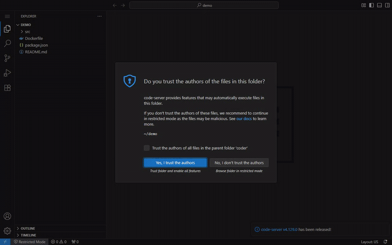

# Code-Server — VS Code in the browser + rootless Docker-in-Docker

<p align="center">
  <br>
  <sub>▶ <a href="preview/demo.mp4">full-resolution MP4</a></sub>
</p>

VS Code in the browser ([code-server](https://github.com/coder/code-server)) with an inner **rootless** Docker daemon, so you can build images and run devcontainers inside it without touching the host Docker or the production stack on the same VPS.

One image, built by GitHub Actions, pushed to GHCR (`ghcr.io/meizuno/code-server`), and run with **one identical command** on the laptop and on the VPS — no host runtime to install.

## How it works

- The image contains Docker Engine + rootless extras (`rootlesskit`, `slirp4netns`, `fuse-overlayfs`), Node.js 22 LTS, `@devcontainers/cli`, git and curl — **nothing more**. Language toolchains (Python, Rust, Elixir, ...) belong in per-project devcontainers.
- The inner `dockerd` runs **rootless**, as the unprivileged `coder` user (uid 1000) via user namespaces (`/etc/subuid`, `/etc/subgid`), with slirp4netns networking and fuse-overlayfs storage. Its socket is `unix:///run/user/1000/docker.sock`; its data root is `~/.local/share/docker`, which lives on the `coder-home` volume — inner images survive container re-creates.
- The entrypoint starts `dockerd-rootless.sh` in the background, polls `docker info` until the daemon is ready, then execs code-server's stock entrypoint on `0.0.0.0:8080` (published to the host on loopback only).
- Auth: code-server runs with `--auth none` — built-in password auth is disabled. Locally the port is loopback-only; on the VPS the **only** gate is Cloudflare Access in front of the tunnel, so configure Access **before** adding the ingress rule. The Cloudflare tunnel token and `cloudflared` itself stay on the host, never inside this container.

## Security posture — read this before deploying

**What this setup does NOT protect against:** running `dockerd` inside a container without a host runtime like Sysbox requires the **outer container to be `privileged: true`**. A privileged container is not a security boundary against the host — root inside it (or a kernel-level escape) can reach host devices and effectively the host itself. Making the *inner* daemon rootless does not change that.

**What it DOES give you (defense-in-depth):**

- Everything you run day-to-day — code-server, builds, devcontainers — executes as **unprivileged uid 1000**, never as root. An escape from the *inner* daemon or a devcontainer lands as a nobody-grade user inside the outer container, not root.
- The inner daemon has its own image store, network and containers — nothing inside it can see or manage the host Docker or the production stack through normal means (no host socket is mounted, `docker ps` inside shows only inner containers).
- Exposure is minimized: the port is bound to `127.0.0.1` on the host, and ingress goes through Cloudflare Access. Note that code-server itself runs with `--auth none`, so Access (remote) and loopback-only publishing (local) are the entire access control — there is no password fallback.

**If hard host-level isolation from the production stack is the priority**, this is not the strongest option — use [Sysbox](https://github.com/nestybox/sysbox) (unprivileged outer container, host-installed runtime) or a separate VM instead. This repo deliberately trades that for zero host prerequisites and identical local/server behavior.

`docker-compose.yml` also contains a commented-out reduced-privilege alternative (`security_opt: seccomp/apparmor/systempaths=unconfined` + `cap_add: SYS_ADMIN` + `/dev/fuse`) for hosts that allow unprivileged user-namespace nesting. It is **fragile and host-dependent** — if you switch to it, re-run all acceptance checks.

## Run — same command everywhere

```bash
docker compose up -d --build
```

That's it — identical on the laptop and the VPS. To use the prebuilt GHCR image instead of building locally:

```bash
docker compose pull && docker compose up -d
```

Open http://localhost:8080 — no login prompt (auth is disabled; see [Security posture](#security-posture--read-this-before-deploying)). To update on the server: `git pull`, then re-run the same command.

## Ingress: existing cloudflared tunnel

Do **not** create a new tunnel. Add an ingress rule to the host's existing tunnel config (`/etc/cloudflared/config.yml` or the Zero Trust dashboard), before the catch-all rule:

```yaml
ingress:
  - hostname: code.<mydomain>
    service: http://localhost:8080
  # ...existing rules...
  - service: http_status:404
```

Then restart cloudflared (`sudo systemctl restart cloudflared`) and, if the tunnel is CLI-managed, add the DNS route: `cloudflared tunnel route dns <tunnel> code.<mydomain>`.

**Gate it with Cloudflare Access — BEFORE adding the ingress rule:** in Zero Trust → Access → Applications, add a self-hosted application for `code.<mydomain>` with a policy allowing only your identity (email / IdP group). code-server runs with `--auth none`, so Access is the **only** authentication for this privileged container — a hostname wired without an Access policy is an open IDE with Docker on your VPS.

## Working with devcontainers

Open a project folder in code-server and use the CLI from the integrated terminal:

```bash
devcontainer up --workspace-folder .
devcontainer exec --workspace-folder . -- bash
```

All containers run on the **inner rootless** daemon — invisible to the host.

### Reaching a dev server running in a devcontainer

Publish the port from the devcontainer to the code-server container, then use code-server's built-in proxy:

1. Publish the port, e.g. in `devcontainer.json`:
   ```json
   { "appPort": [3000] }
   ```
   (or `docker run -p 3000:3000 ...` for plain containers). The port is now on the code-server container's localhost.
2. Open it through the proxy:
   - `https://code.<mydomain>/proxy/3000/` — path-rewriting proxy, works for most apps.
   - `https://code.<mydomain>/absproxy/3000/` — for apps that generate absolute paths (e.g. **Vite**, webpack dev server); set the app's base path to `/absproxy/3000/`.

### Disk housekeeping

Inner build layers accumulate in `~/.local/share/docker` on the `coder-home` volume. Periodically run, in the code-server terminal:

```bash
docker image prune -f        # and occasionally: docker system prune
```

## CI / image publishing

`.github/workflows/build.yml` builds on every push to `main` and on `v*.*.*` tags, pushing to `ghcr.io/meizuno/code-server` with tags `latest`, `sha-<short-sha>`, and semver (`1.2.3`, `1.2`) on releases. Auth uses the built-in `GITHUB_TOKEN`; the buildx GHA cache keeps rebuilds fast.

## Acceptance checks

Same commands locally and on the server. Start with:

```bash
docker compose up --build
```

1. The container starts and logs "Inner rootless Docker daemon is ready."
2. http://localhost:8080 shows code-server directly (no login prompt — auth is disabled by design).
3. In the code-server integrated terminal, `docker version` shows **both Client and Server**.
4. The daemon is rootless and non-root:
   ```bash
   docker info -f '{{.SecurityOptions}}'   # includes name=rootless
   ps -o user= -C dockerd                  # prints: coder
   ```
5. `docker run --rm hello-world` succeeds.
6. Building a trivial Dockerfile succeeds:
   ```bash
   mkdir -p /tmp/t && printf 'FROM alpine:3.20\nRUN echo ok\n' > /tmp/t/Dockerfile && docker build /tmp/t
   ```
7. `devcontainer --version` prints a version.
8. Isolation: containers started inside do **not** appear in the host's `docker ps`:
   ```bash
   # inside code-server:
   docker run -d --name iso-test alpine sleep 300
   # on the host:
   docker ps            # shows only "code-server", no iso-test
   ```
9. A dummy HTTP server on port 3000 inside code-server is reachable via the proxy:
   ```bash
   # inside code-server:
   npx http-server -p 3000
   # browser:
   http://localhost:8080/proxy/3000/
   ```
